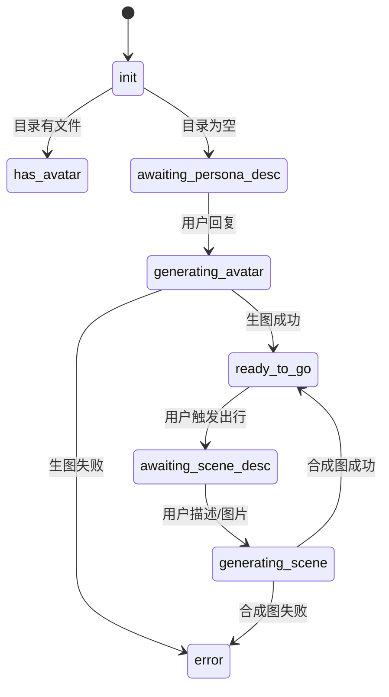
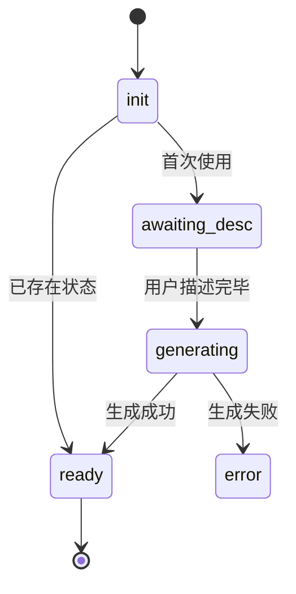
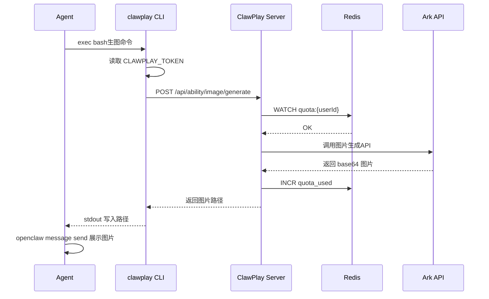

# Skill 开发进阶指南

本文档面向希望深入掌握 Skill 开发的作者，涵盖流程图设计、Prompt 模板导入、可靠性实践，以及编辑器工具的远期规划。

---

## 1. 流程图：将 Skill 固化为 Mermaid 语言

Agent（Claude Code）执行 SKILL.md 时会先理解整个流程文档。为降低 Agent 的理解成本、提升流程可靠性，建议同时提供 Mermaid 流程图。

### 为什么需要 Mermaid

自然语言描述在复杂多步骤 Skill 中容易产生歧义。Mermaid 是声明式语言，Agent 可以精确解析节点和分支，不会因自然语言模糊性而"走错分支"。



### 在 SKILL.md 中嵌入 Mermaid

```markdown
## 流程概览


```

### 常用 Mermaid 模式

| 模式 | 适用场景 | 示例语法 |
|------|---------|---------|
| `stateDiagram-v2` | 阶段机（Skill 核心） | 上面示例 |
| `flowchart LR` | 线性流程 | `A --> B --> C` |
| `sequenceDiagram` | API 调用时序 | 展示 Agent → CLI → API → Provider |
| `erDiagram` | 数据模型 | 状态文件字段关系 |

**序列图示例**（展示生图请求的完整链路）：



### Agent 解析 Mermaid 的约定

Skill 文档中的 Mermaid 图应与自然语言描述一一对应：

1. **节点 ID = phase 名称**：`awaiting_desc`、`generating`、`error` 与状态文件中的 `phase` 字段完全一致
2. **分支条件用 Guard 标注**：`has_avatar: 目录有文件`（条件写在箭头上方）
3. **错误状态单独成节点**：`error` 分支便于 Agent 统一处理失败路径

---

## 2. Prompt 模板：从 AIGC 工具无缝导入

AIGC 创作者通常在专业工具（可灵、即梦、ComfyUI、Midjourney、Stable Diffusion）上创作 Prompt。ClawPlay Skill 需要能够接收并转换这些 Prompt。

### Prompt 格式映射

| 来源工具 | 格式特点 | 转换为 ClawPlay 的方法 |
|---------|---------|----------------------|
| Midjourney | `/imagine prompt: [描述] --[参数]` | 提取 `[描述]` 部分，去除 `--ar` `--s` 等参数，保留英文描述 |
| ComfyUI | JSON 工作流节点 | 从 `CLIPTextEncode` 节点提取 `text` 字段，拼装为自然语言描述 |
| Stable Diffusion | WebUI 标签格式 | 去除 `masterpiece, best quality` 等质量词，保留核心主体描述 |
| 即梦/可灵 | 中文自然语言 | 直接使用或翻译为英文，补充 `maintaining character consistency` |
| DALL-E / Imagen | 自然语言描述 | 直接使用（ClawPlay prompt 格式与之一致） |

### Prompt 提取与转换示例

**Midjourney Prompt 转换**：

```bash
# 用户发送：/imagine prompt: a cute cyberpunk shrimp wearing neon sunglasses --ar 16:9 --s 250 --niji 6
# 提取有效描述部分
MIDJOURNEY_PROMPT="a cute cyberpunk shrimp wearing neon sunglasses"

# 构造 ClawPlay 生图 prompt（保留原意，补充风格描述）
clawplay image generate \
  --prompt "A photorealistic illustration of a cute cyberpunk shrimp wearing neon sunglasses, cyberpunk aesthetic, vibrant neon colors, detailed digital art, 2K" \
  --output ~/.openclaw/persona/avatar.png
```

**ComfyUI CLIPTextEncode 提取**（Agent 读取 SD WebUI 的 PNG metadata 或 ComfyUI JSON）：

```bash
# 读取 PNG 中的 Stable Diffusion prompt metadata
python3 -c "
import json, sys, base64, zlib
# 从 PNG tEXt chunk 或图片 metadata 提取
print('Extracted prompt from image metadata')
"
```

### 角色一致性 Prompt 模板

当 Skill 需要多图保持角色一致时，使用以下标准化 Prompt 模板：

```bash
# === 角色设计参考图 ===
# 主体：<从用户原始 Prompt 提取的角色描述>
# 风格：<AIGC 工具对应的风格标签，如 chibi kawaii / cyberpunk / Pop Mart blind box>
# 用途：角色形象参考图（generation_type=character_design）

clawplay image generate \
  --prompt "<角色主体描述>, <风格标签>, character design reference sheet, three views, consistent character, high quality digital art, 2K" \
  --output ~/.openclaw/persona/avatar.png

# === 场景合成图 ===
# 参考：--ref 传入已生成的角色参考图
# 描述：<用户提供的场景描述，保持角色主体描述>
# 用途：角色在特定场景中的合成图（generation_type=scene_compose）

clawplay image generate \
  --prompt "<角色简要描述，3-5个关键词>, <场景详细描述>, maintaining character consistency with reference image, high quality digital art, 2K" \
  --ref ~/.openclaw/persona/avatar.png \
  --output ~/.openclaw/persona/<scene>.png
```

---

## 3. 可靠性设计：让 Skill 更健壮

### 幂等性原则

Skill 的每个分支应尽量设计为幂等操作——同一状态多次执行结果一致。

```
✅ 幂等：检查文件存在则跳过生成
❌ 非幂等：每次都重新生成（覆盖旧文件）
```

```bash
set -euo pipefail

AVATAR_PATH=~/.openclaw/persona/avatar.png
mkdir -p ~/.openclaw/persona/

if [ -f "$AVATAR_PATH" ]; then
  echo "Avatar already exists at $AVATAR_PATH"
else
  clawplay image generate --prompt "..." --output "$AVATAR_PATH"
fi
```

### 状态恢复

Agent 重启或对话中断后应从上次 phase 继续，而非从头开始：

```bash
STATE_FILE=~/.openclaw/workspace/memory/my-skill-state.json
mkdir -p ~/.openclaw/workspace/memory/

# 读取当前 phase
PHASE=$(python3 -c "
import json, os
path = os.path.expanduser('${STATE_FILE}')
if os.path.exists(path):
    with open(path) as f:
        print(json.load(f).get('phase', 'init'))
else:
    print('init')
")
echo "Current phase: $PHASE"
```

### 超时与重试

```bash
# 带超时和重试的生图（最多3次）
MAX_RETRIES=3
RETRY_DELAY=5

for i in $(seq 1 $MAX_RETRIES); do
  echo "[Attempt $i/$MAX_RETRIES] Generating image..."
  if clawplay image generate --prompt "$PROMPT" --output "$OUTPUT"; then
    echo "Success: $OUTPUT"
    break
  else
    echo "Attempt $i failed, retrying in ${RETRY_DELAY}s..." >&2
    sleep $RETRY_DELAY
    RETRY_DELAY=$((RETRY_DELAY * 2))  # 指数退避
    if [ $i -eq $MAX_RETRIES ]; then
      echo "All retries failed after $MAX_RETRIES attempts" >&2
      exit 1
    fi
  fi
done
```

### 资源清理

```bash
# 临时文件用 trap 清理（脚本异常退出时也清理）
cleanup() {
  rm -f /tmp/clawplay-temp-*.png
  rm -f /tmp/clawplay-temp-*.json
}
trap cleanup EXIT INT TERM
```

---

## 4. SKILL.md 结构检查清单

提交 Skill 前，使用以下清单自检：

- [ ] **frontmatter 完整**：`name`、`description`、`metadata.openclaw` 齐全
- [ ] **Token 检查前置**：每个需要生图/调用的分支都检查 `CLAWPLAY_TOKEN` 是否配置
- [ ] **目录存在性检查**：`mkdir -p` 在任何写入操作前执行
- [ ] **绝对路径**：所有文件路径使用 `~` 展开或绝对路径
- [ ] **错误处理**：`set -euo pipefail`，关键命令有 `|| { ...; exit 1; }`
- [ ] **状态持久化**：每个分支写入状态文件，Agent 重启可恢复
- [ ] **Mermaid 流程图**：phase 分支数量 ≥ 3 时建议附上流程图
- [ ] **Prompt 模板示例**：提供可运行的 `clawplay image generate` 示例
- [ ] **阶段说明表格**：`## 阶段说明` 节附上 phase → 含义对照表
- [ ] **错误信息友好**：失败时发送给用户的不是 exit code，而是可读的错误描述

---

## 5. 远期规划：社交/娱乐 Skill 编辑器

以上文档和实践经过多个 Skill 迭代后，会沉淀出大量可复用的模式。长期来看，这些经验可以固化为工具：

### 规划方向

| 工具 | 功能 | 核心价值 |
|------|------|---------|
| **Skill 可视化编辑器** | 拖拽式构建 phase 流程图，自动生成 SKILL.md 和 Mermaid 图 | 降低非技术开发者门槛 |
| **Prompt 转换器** | 从 Midjourney/ComfyUI/SD WebUI 导入 Prompt，一键生成 ClawPlay 格式 | 对齐 AIGC 创作者工作流 |
| **状态机验证器** | 检查 SKILL.md 中 phase 状态是否覆盖所有分支，检测死循环和孤立状态 | 提升 Skill 健壮性 |
| **在线 Playgroud** | 输入用户消息，模拟 Agent 执行路径，可视化 phase 跳转 | 缩短调试周期 |
| **社区模板市场** | 开发者分享 Prompt 模板、流程设计模板、工作流片段 | 沉淀最佳实践 |

### 实现路径建议

**Phase 1（工具化）**：
- 将本文档中的检查清单实现为自动化 lint 工具（`clawplay skill lint`）
- 将 Mermaid 图生成集成到编辑器，在线预览 phase 跳转

**Phase 2（编辑器化）**：
- 基于 Phase 1 的 lint 逻辑构建可视化流程编辑器
- 支持导入已有 SKILL.md 编辑后再导出

**Phase 3（平台化）**：
- 加入社区分享、fork、版本管理功能
- 与 ClawPlay Web 的 Skill 提交流程打通

---

## 下一步

- 查看完整命令参考：`docs/clawplay-commands.md`
- 参考实现：`example-skills/take-your-claw/SKILL.md`
- 参与社区讨论：[GitHub Issues](https://github.com/nura-space/ClawPlay/issues)
